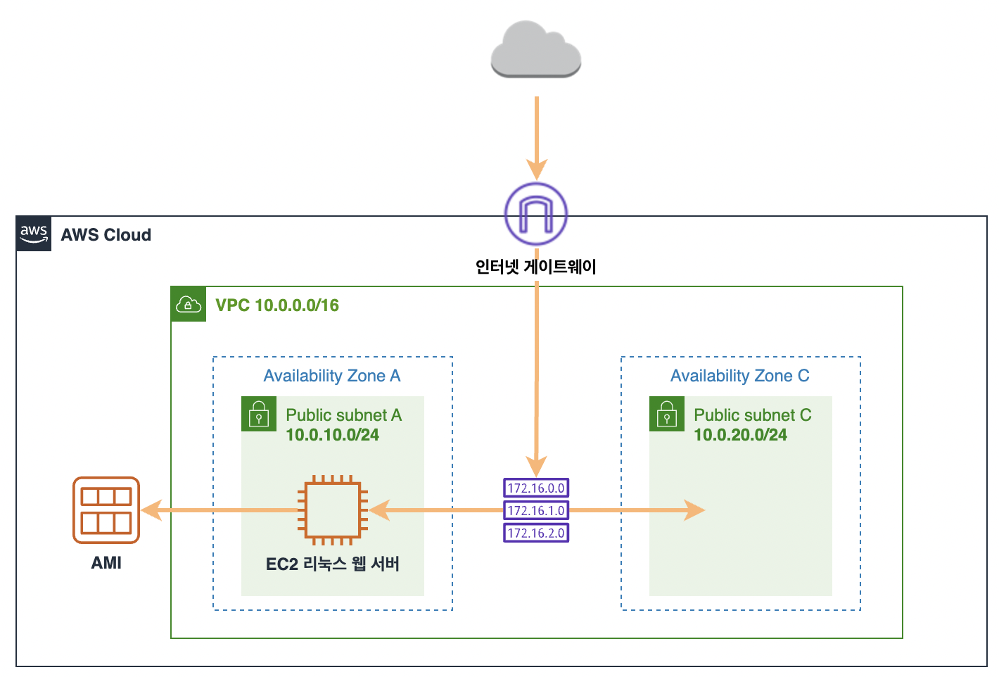
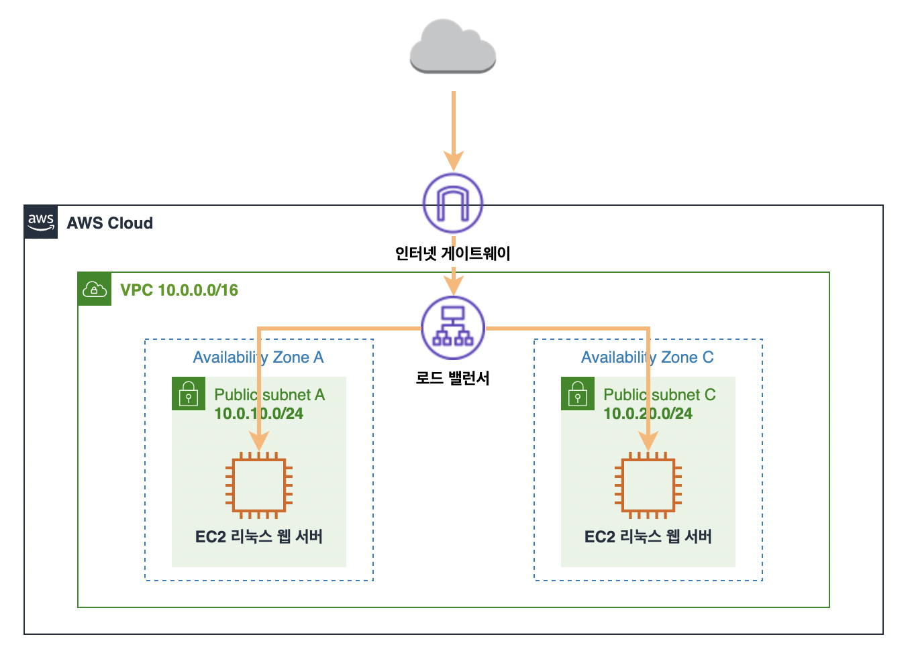
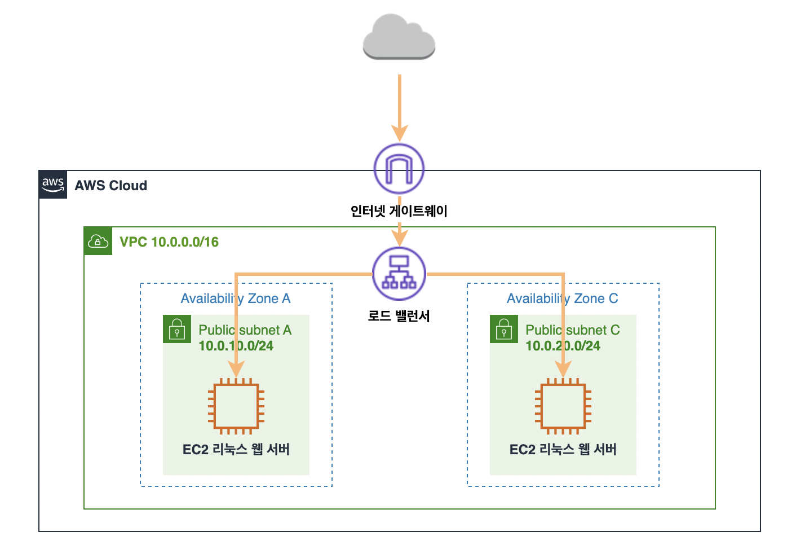

# 🎯 트러블 슈팅
## 1. AWS 실습 중 인스턴스 생성 후 퍼블릭 IPv4 주소를 클릭해서 연결하는데 연결에 실패

### 해결 방법
❌ / 실습을 따라하던 중 실수가 있는지 처음부터 확인해보고 다시 따라해봄  
-> 연결 실패  
⭕️ / URL에 http:// 를 붙여 시도해봄 -> 연결 성공  
: http:// 를 명시하지 않으면 https로 시도할 수 있음

## 📌 웹 서버 생성하기

### 2. AMI 생성하기
- **Amazon Machine Image(AMI)**
: 인스턴스를 시작하는데 필요한 정보를 제공. 동일한 구성의 인스턴스가 여러 개 필요할 때는 한 AMI를 사용하여 여러 인스턴스를 시작 가능

#### AMI 생성
- 생성한 인스턴스 클릭 -> 작업 -> 이미지 및 템플릿 -> 이미지 생성
- **이름**
: webserver-ami / 입력 후 이미지 생성

### 3. AMI 기반 인스턴스 생성하기

#### AMI 기반 인스턴스 생성
- AMI 상태가 사용 가능이면 AMI로 인스턴스 시작 버튼을 클릭
- **이름**
: webserver 2
- **키 페어(로그인)**
: keymair-seoul
- 네트워크 설정 -> 편집
- **VPC**
: VPC-Lab
- **서브넷**
: public subnet C
- **퍼블릭 IP 자동 할당**
: 활성화
- **방화벽(보안 그룹)**
: 기존 보안 그룹 선택 -> webserver-sg
- 인스턴스 시작

## 📌 로드밸런서 구성하기

### Elastic Load Balancing(ELB) 이해하기
- 앱 트래픽을 여러 대상에 자동 분산
1. Application Load Balancer
2. Network Load Balancer
3. Gateway Load Balancer
4. Classic Load Balancer

### 로드밸런서 생성
- 로드 밸런서 -> 로드 밸런서 생성 버튼 클릭 -> Application Load Balancer 선택
- **로드 밸런서 이름**
: web-alb
- **VPC**
: VPC-Lab
- **매핑**
: public subnet A, public subnet C 선택
- **보안 그룹**
: 새 보안 그룹 생성 -> 이름 - webalb-sg, 설명 - security group for load balancer -> VPC-Lab으로 변경 -> 인바운드 규칙 - HTTP, 소스 - 내 IP -> 보안 그룹 생성 -> 방금 만든 보안 그룹 지정
- **리스너 및 라우팅**
: 대상 그룹 생성 클릭 -> 인스턴스 선택, 이름 - webserver-tg -> 프로토콜 - HTTP -> VPC - VPC-Lab 지정 후 다음
- **대상 등록**
: webserver 1 과 webserver 2 를 아래에 보류 중인 것으로 포함 버튼을 통해 대상으로 등록
- **리스너 및 라우팅으로 복귀**
: 리스너 및 라우팅에서 대상 그룹으로 지정. 오른쪽 아래의 로드밸런서 생성으로 로드밸런서를 생성
- **보안 그룹 메뉴**
: webserver-sg 선택 -> 인바운드 규칙 편집 -> HTTP 규칙 삭제 -> 새로운 규칙 생성 -> HTTP, 소스 - 사용자 지정, webalb-sg 지정 -> 규칙 저장
- **로드 밸런서 메뉴**
: 상태 확인(active) -> 설명에 DNS 이름 복사 후 웹 브라우저에 붙임(안될 경우 http://"DNS 이름")

### 로드밸런서 대상 상태 확인
- 대상 그룹 -> webserver-tg -> 대상 - 상태 healthy