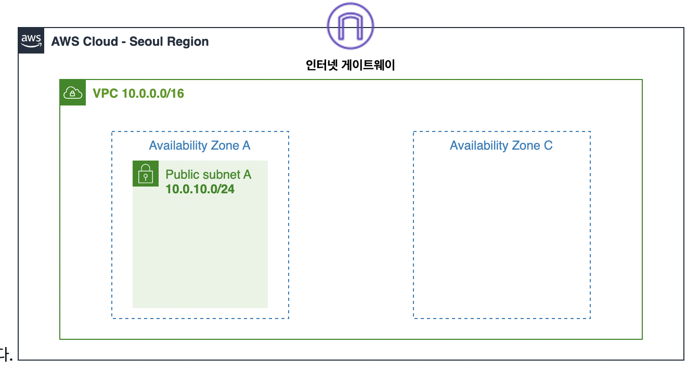
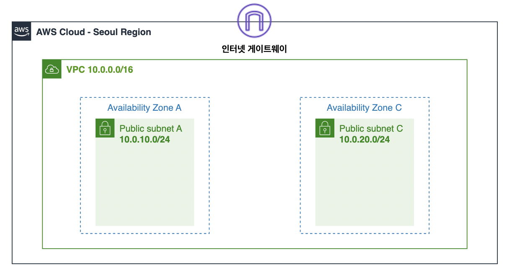
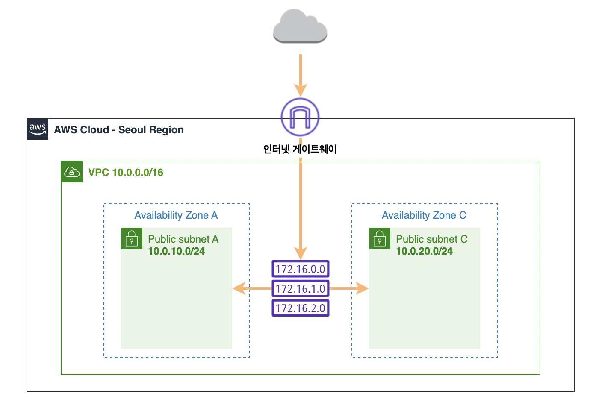

# AWS 기초 과정 실습

## 📌 VPC(Virtual Private Cloud) 이해하기
- VPC를 이용하면 사용자가 정의한 가상의 네트워크 공간 안에서 AWS 리소스를 시작할 수 있음
- VPC는 AWS 클라우드의 격리된 부분. EC2 인스턴스와 같은 AWS 객체로 채워짐

### 1. VPC 생성하기
- **이름**
: VPC-Lab
- **IPv4 CIDR 블록**
: 10.0.0.0/16
- **가용 영역(az)**
: ap-northest-2a, 1개
- **서브넷**
: 퍼블릭 1개 - 10.0.10.0/24, 프라이빗 0개
- **서브넷 이름**
: public subnet A

❗️CIDR(Classless Inter-Domain Routing) 주소 범위 이해하기
- 네트워크의 주소와 크기를 표현하는 방식 중 하나
- **IP 주소 + 서브넷 마스크**
- **서브넷 마스크**
: IP 주소를 네트워크 부분과 호스트 부분으로 나누기 위한 기준선
- 255.0.0.0 -> /8, 255.255.0.0 -> /16, 255.255.255.0 -> /24, 255.255.255.128 -> /25, 255.255.255.240 -> /29
- 실제 사용할 수 있는 IP 수는 -2 해야함. 첫 IP는 네트워크 주소, 마지막 IP는 브로드캐스트 주소.

### 2. 추가 subnet 생성하기
- 고가용성을 확보하기 위해, 다중 가용 영역에 서비스를 배포하는 것이 중요
- **서브넷 이름**
: public subnet C
- **가용 영역**
: 아시아 태평양 (서울) / ap-northeast-2c
- **IPv4 서브넷 CIDR 블록**
: 10.0.20.0/24

### 3. 라우팅 테이블 편집하기

#### VPC 라우팅 테이블 개념
- 서브넷 또는 게이트 웨이의 네트워크 트래피이 전송되는 위치를 결정하는데 사용되는 **라우팅**이라는 규칙 집합이 포함되어 있음
- **기본 라우팅 테이블**
: VPC와 함께 자동으로 생성되는 라우팅 테이블. 모든 서브넷의 라우팅을 제어
- **사용자 지정 라우팅 테이블**
: 기본 라우팅 테이블 외에 사용자가 생성한 라우팅 테이블

#### 라우팅 테이블 연결 편집
- 서브넷 메뉴에서 public subnet C -> 작업 -> 라우팅 테이블 연결 편집
- 라우팅 테이블 ID에서 기본 라우팅 테이블이 아닌 다른 라우팅 테이블을 선택, 저장
- public subnet C도 인터넷으로 향하는 경로가 생성되었는지 확인
