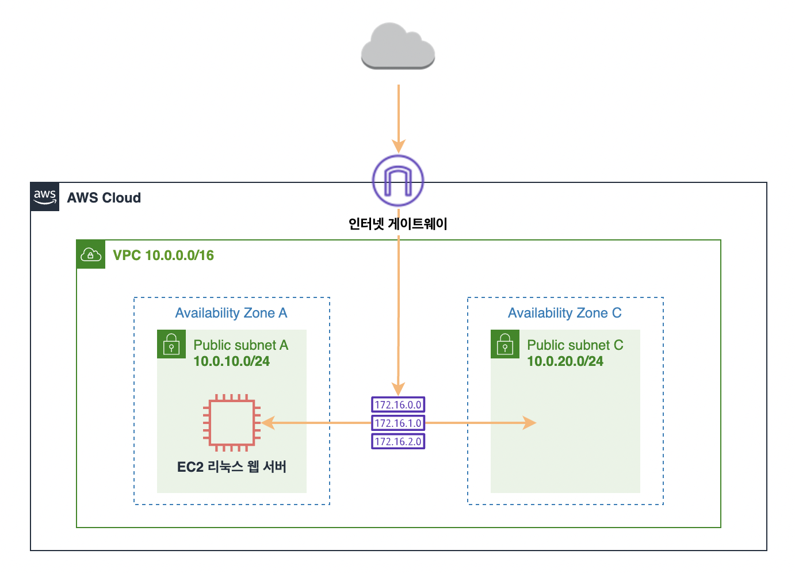
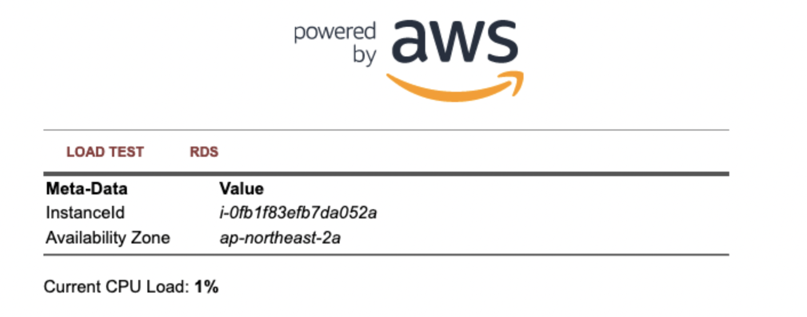
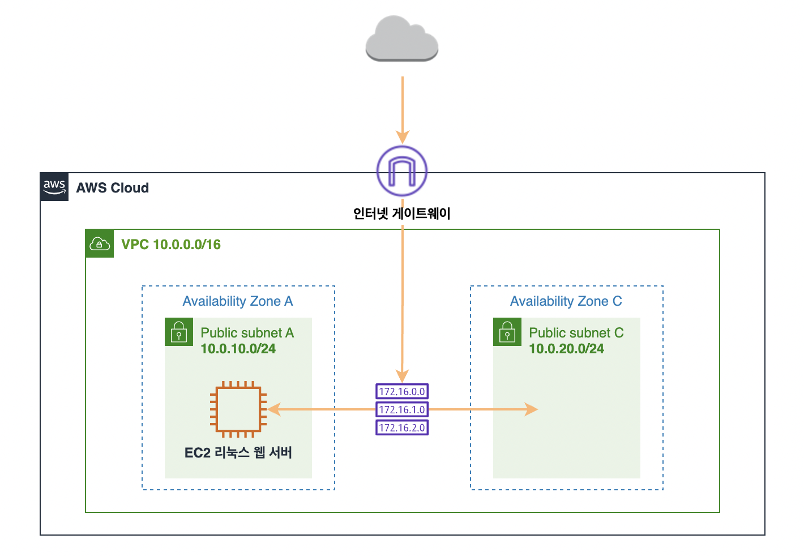

# AWS 기초 과정 실습

## 📌 네트워크 구성

### 1. VPC(Virtual Private Cloud) 이해하기
- VPC를 이용하면 사용자가 정의한 가상의 네트워크 공간 안에서 AWS 리소스를 시작할 수 있음
- VPC는 AWS 클라우드의 격리된 부분. EC2 인스턴스와 같은 AWS 객체로 채워짐

#### VPC 생성하기
- **이름**
: VPC-Lab
- **IPv4 CIDR 블록**
: 10.0.0.0/16
- **가용 영역(az)**
: ap-northest-2a, 1개
- **서브넷**
: 퍼블릭 1개 - 10.0.10.0/24, 프라이빗 0개
- **서브넷 이름**
: public subnet A


❗️CIDR(Classless Inter-Domain Routing) 주소 범위 이해하기
- 네트워크의 주소와 크기를 표현하는 방식 중 하나
- **IP 주소 + 서브넷 마스크**
- **서브넷 마스크**
: IP 주소를 네트워크 부분과 호스트 부분으로 나누기 위한 기준선
- 255.0.0.0 -> /8, 255.255.0.0 -> /16, 255.255.255.0 -> /24, 255.255.255.128 -> /25, 255.255.255.240 -> /29
- 실제 사용할 수 있는 IP 수는 -2 해야함. 첫 IP는 네트워크 주소, 마지막 IP는 브로드캐스트 주소.

### 2. 추가 subnet 생성하기
- 고가용성을 확보하기 위해, 다중 가용 영역에 서비스를 배포하는 것이 중요
- **서브넷 이름**
: public subnet C
- **가용 영역**
: 아시아 태평양 (서울) / ap-northeast-2c
- **IPv4 서브넷 CIDR 블록**
: 10.0.20.0/24


### 3. 라우팅 테이블 편집하기

#### VPC 라우팅 테이블 개념
- 서브넷 또는 게이트 웨이의 네트워크 트래피이 전송되는 위치를 결정하는데 사용되는 **라우팅**이라는 규칙 집합이 포함되어 있음
- **기본 라우팅 테이블**
: VPC와 함께 자동으로 생성되는 라우팅 테이블. 모든 서브넷의 라우팅을 제어
- **사용자 지정 라우팅 테이블**
: 기본 라우팅 테이블 외에 사용자가 생성한 라우팅 테이블

#### 라우팅 테이블 연결 편집
- 서브넷 메뉴에서 public subnet C -> 작업 -> 라우팅 테이블 연결 편집
- 라우팅 테이블 ID에서 기본 라우팅 테이블이 아닌 다른 라우팅 테이블을 선택, 저장
- public subnet C도 인터넷으로 향하는 경로가 생성되었는지 확인


### 4. 보안 그룹 생성하기

#### 보안 그룹 생성
- 보안 그룹은 인스턴스에 대한 인바운드 및 아웃바운드 트래픽을 제어하는 가상 방화벽 역할
- 보안 그룹 -> 보안 그룹 생성
- **보안 그룹 이름**
: webserver-sg
- **설명**
: security group for web servers
- **VPC**
: (VPC-Lab) 선택
- **인바운드 규칙**
: SSH, HTTP -> 내 IP

## 📌 웹 서버 생성하기
- **EC2(Elastic Compute Cloud) 이해하기**
: 하드웨어 선투자 없이 더 빠르게 앱 개발, 배포 가능. 원하는 만큼 가상 서버를 구축하고 보안 및 네트워크 구성과 스토리지 관리 가능.


### 1. 웹 서버 인스턴스 생성
- 인스턴스 시작
- **이름**
: webserver 1
- **Quick Start**
: image > Amazon Linux 2 AMI (HVM) - Kernel 5.10, SSD Volume Type. 아키텍처 > 64비트(x86)
- **인스턴스 유형**
: t2.micro
- **키 페어 생성**
: 이름 > keypair-seoul, 유형 > RSA, 형식 > .pem >> 키 페어 생성
- **네트워크 설정**
: 편집 클릭 -> VPC-Lab, public subnet A, 퍼블릭 IP 자동 할당 활성화 -> 기존 보안그룹 선택, webserver-sg -> 스토리지 구성 8, gp2 -> 고급 세부 정보에 아래 코드 복붙 후 인스턴스 시작
```
#!/bin/sh
        
# Install a LAMP stack
sudo amazon-linux-extras install -y lamp-mariadb10.2-php7.2 php7.2
sudo yum -y install httpd php-mbstring
sudo yum -y install git
        
# Start the web server
sudo chkconfig httpd on
sudo systemctl start httpd
        
# Install the web pages for our lab
if [ ! -f /var/www/html/aws-boarding-pass-webapp.tar.gz ]; then
    cd /var/www/html
    wget -O 'techcamp-webapp-2024.zip' 'https://ws-assets-prod-iad-r-icn-ced060f0d38bc0b0.s3.ap-northeast-2.amazonaws.com/600420b7-5c4c-498f-9b80-bc7798963ba3/techcamp-webapp-2024.zip'
    unzip techcamp-webapp-2024.zip
    sudo mv techcamp-webapp-2024/* .
    sudo rm -rf techcamp-webapp-2024
    sudo rm -rf techcamp-webapp-2024.zip
fi
        
# Install the AWS SDK for PHP
if [ ! -f /var/www/html/aws.zip ]; then
    cd /var/www/html
    sudo mkdir vendor
    cd vendor
    sudo wget https://docs.aws.amazon.com/aws-sdk-php/v3/download/aws.zip
    sudo unzip aws.zip
fi
        
# Update existing packages
sudo yum -y update
```

⭕️ 성공 시


현재 아키텍처 상황
