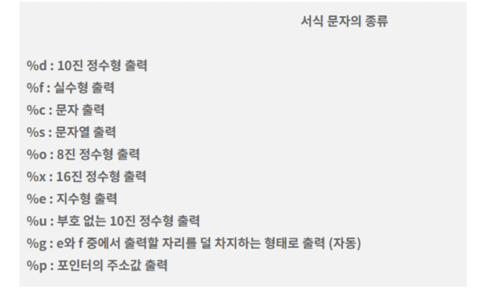

# 📌 C언어

## 1. C언어의 구조

- **#include<stdio.h>**
: 선행처리기. printf(), scanf() 같은 함수 사용 가능
- **int main()**
: 프로그램의 시작점. main함수가 작업을 마친 후 운영체제에게 정수(int) 값을 반환한다는 뜻
- **printf()**
: 괄호 안의 내용을 출력
- **return 0;**
: 문제 없이 잘 실행되고 종료됨
- **\n**
: 줄바꿈기호.

## 2. 변수와 자료형

- **변수**
: 데이터를 저장하는 공간
- **자료형**

```
int age;          // 정수를 저장할 age라는 이름의 변수 선언
double PI = 3.14; // 실수를 저장할 PI 변수를 선언하고 3.14로 초기화
char grade = 'A'; // 문자를 저장할 grade 변수를 선언하고 'A'로 초기화
```

## 3. 서식문자



## 4. scanf()

- **표준 입력(키보드)** 으로부터 데이터를 읽어 변수에 저장할 때 사용하는 함수
- printf()와 마찬가지로 #include<stdio.h>가 있어야 사용 가능
- &는  앰퍼샌드(ampersand)라고 읽으며 주소연산자라고도 함
- ⚠️ 주의: 문자열(%s)을 제외한 나머지 형식은 모두 변수 앞에 & 주소 연산자를 붙여야 함.
```
#include <stdio.h>

int main() {
    int age;
    float height;
    char name[20];

    printf("나이를 입력하세요: ");
    scanf("%d", &age);

    printf("키를 입력하세요(m): ");
    scanf("%f", &height);

    printf("이름을 입력하세요: ");
    scanf("%s", name);  // 문자열은 & 없이 변수 이름만

    printf("\n[입력 결과]\n");
    printf("이름: %s\n", name);
    printf("나이: %d세\n", age);
    printf("키: %.2f m\n", height);

    return 0;
}
```

## 5. 사칙연산과 증감연산자
- **사칙연산**
: 수학에서 배운 것과 동일. *,/,% 다음 +,-
- **증감연산자**
: ++a(전치연산). 앞에 붙고 바로 계산 / a--(후치연산). 뒤에 붙고 그 다음 라인부터 계산

## 6. 비트연산자

- 데이터를 비트(bit) 단위로 조작하는 연산자(2진수)
- 예시 / 10진수 20 -> 2진수 10100
- **&** 
: 둘 다 1일 때 1 반환
- **^** 
: 두개가 1개는 1, 나머지는 0이어야만 1반환
- **|** 
: 둘중 1개만 1일 때도 1반환
- **>>**
: 비트를 이동시키는 연산자. 8>>2 라고 하면 8에서 2의 제곱만큼 나누기 -> 2
- **<<**
: 8<<2 라고 하면 8에서 2의 제곱만큼 곱하기 -> 32

## 7. 조건문


**if문**과 **switch-case문**

1. **if문**  
if-else : 조건문 중 해당하는 조건식 1개만 실행  
if-if-if : 해당 조건에 맞는 모든 조건문 전부 실행

2. **switch-case문**
: ()안의 값에 해당하는 case문 실행  
break: 조건문을 종료하라는 키워드  
default: else와 같음

## 8. 반복문

**for문**, **while문**, **do-while문**

1. **for문**  
for(시작값;조건식;증가감식)  
```
for(int i=0; i<=5; i++) {
    printf("%d", i);
}
```

2. **while문**  
```
int i=0;  
while(i<=5) {
    printf("%d", i);
    i++;
}
```
continue : 다음 실행문을 실행하지 않고 건너뜀

3. **do-while문**  
조건 중괄호 {} 블럭을 한번 실행하고, 조건을 검사하여 반복을 결정
```
int i=0;
do {
    printf("%d", i);
    i++;
} while (i<=5);

return 0;
```

## 9. 배열

- 같은 자료형의 값들을 하나의 변수 이름으로 연속적으로 저장할 수 있는 자료구조
- 자료형 배열이름[크기];
```
int scores[5];      // 정수형 배열 5칸
char name[10];      // 문자형 배열 10칸
```

- 배열 초기화
```
int scores[5] = {90, 80, 70, 60, 50};
```
❗️ 초기화하지 않은 경우, 배열 값은 쓰레기 값(불특정 값) 을 가질 수 있음.  


- 배열의 각 요소는 0부터 시작하는 인덱스로 접근
```
scores[0] = 100;    // 첫 번째 요소에 100 저장
printf("%d", scores[0]);  // 첫 번째 요소 출력
```

## 10. 포인터

- 메모리의 주소값을 저장하는 변수. **포인터 변수**
- 포인터 변수의 선언
```
int *p = null;
```
- 항상 4byte의 동일한 크기를 가짐
1. 주소 연산자(&)
: 변수의 이름 앞에 사용, 해당 변수의 **주소 값 반환**

2. 참조 연산자(*)
: 포인트의 이름이나 주소 앞에 사용, 포인터에 가리키는 주소에 **저장된 값을 반환**

```
int main() {
    int a = 3;
    int b = &a;
    int *c = &a;
    printf("%d\n", a); // 변수 a 출력
    printf("%d\n", b); // b에 저장된 a의 주소의 값을 출력
    printf("%d\n", c); // 포인터 변수 c에 저장된 a의 주소 출력
    printf("%d\n", *c); // 포인터 변수 c에 저장된 a의 주소의 값 출력
    return 0;
}
```
⭕️ 결과  
printf("%d\n", a); -> 3  
printf("%d\n", b); -> a의 주소 값  
printf("%d\n", c); -> a의 주소 값  
printf("%d\n", *c); -> 3